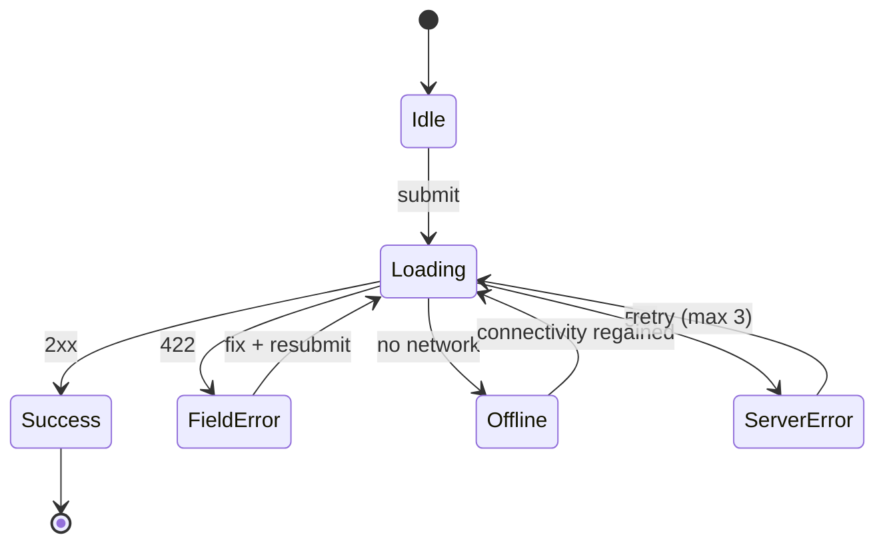

# Flows, navigation & states — reference

## 1. Flow notation (keep it in the repo, in text)


Why text: it diffs in PRs, it never goes stale in a design tool nobody opens, and the agent can
read it. Store under `docs/flows/<feature>.md`.

## 2. Choosing a navigation model

| Model | Use when | Avoid when |
|---|---|---|
| Bottom tabs (3–5) | Few top-level areas, frequently switched | > 5 areas, or areas rarely used |
| Navigation rail / drawer | Medium/expanded windows, many areas | Primary phone navigation for core features |
| Hub and spoke | A dashboard with distinct deep tasks | Users need to switch contexts constantly |
| Wizard / stepper | A linear task with a defined end (checkout, onboarding) | Exploratory tasks |
| Content-driven (feed → detail) | Consumption apps | Task/tool apps |
| Modal | A focused, interrupting sub-task the user must finish or cancel | Anything the user may want to compare or leave |

Rules:
- Depth ≤ 3 taps to any core task.
- Never hide a primary feature behind a hamburger menu.
- Back must always be predictable; never trap the user in a loop.
- Deep links must be able to construct a sensible back stack.

## 3. The eight states — enumerate for every screen

1. **First run / empty (never had data)** — teach + one action.
2. **Loading** — skeleton matching the final layout after 300ms; nothing before that.
3. **Partial** — some data loaded, some failed: show what you have.
4. **Ready** — the normal state.
5. **No results** — a filter/search returned nothing: echo the query + offer a way out.
6. **Error** — cause + recovery action.
7. **Offline** — cached content + a non-blocking banner.
8. **Permission / auth denied** — explain the value, offer settings deep link or an alternative path.

Plus data edge cases for every one: 1 item, 1000 items, 60-character names, missing images,
RTL text, 200% font scale, no photo, expired session mid-action.

## 4. Form design rules
- One column. Always. Multi-column forms increase completion time and errors.
- Label **above** the field, always visible (floating labels that vanish break recall and a11y).
- Group into sections of ≤ 7 fields; show progress for multi-step forms.
- Mark **optional** fields rather than required ones when most are required (and vice versa).
- Validate on blur, not on every keystroke; show success validation for complex fields (password, username).
- Never clear input on error. Preserve everything, including across process death.
- Match the keyboard to the input (`email`, `number`, `phone`), enable autofill hints.
- Inline errors under the field, with the field border in the error color **and** an icon.
- Submit button: disabled only when you can explain why; otherwise let them submit and show errors.
- Long forms: autosave drafts.
- Reduce the field count before beautifying the form — the fastest form is the one you deleted.

## 5. Onboarding patterns

| Pattern | Use when | Rule |
|---|---|---|
| No onboarding | The app is self-evident | Best case — aim here |
| Value-first (guest mode) | Content apps | Show value before asking for anything |
| Progressive / just-in-time coach marks | Non-obvious gestures | One tip at the moment of relevance, dismissible |
| Setup wizard | The app is useless without configuration | ≤ 3 steps, skippable, with defaults |
| Carousel | Rarely justified | ≤ 3 slides, skippable, benefits not features |

Measure: time-to-first-value (TTFV). If a user cannot reach the core value in under 60 seconds,
the onboarding is the problem.

## 6. Permission priming
```
1. User taps a feature that needs the permission (never on launch).
2. In-app explainer: what you'll do with it + the benefit + [Not now] [Continue].
3. Only then the system dialog.
4. If denied: keep the feature usable in a degraded way, and show a path to Settings.
5. If "denied forever": explain and deep-link to app settings; never nag.
```
Asking cold burns the one system prompt you get.

## 7. Notifications
- Channels per category, named in user language; let users mute one thing without muting all.
- Every notification: actionable, timely, and it must deep-link to the exact relevant screen.
- Bundle related notifications; never send more than the user's tolerance (measure opt-out rate).
- Ask for `POST_NOTIFICATIONS` after the user has seen why it matters.
- Quiet hours and frequency caps for anything non-transactional.

## 8. Search & filtering
- Show recent + suggested queries on focus.
- Debounce 300ms; show results as you type when cheap.
- Zero-results state must echo the query and offer: clear filters, spelling suggestion, browse alternative.
- Filters: show active filter count, allow clearing all in one tap, persist across navigation.

## 9. Handoff artifact template
```markdown
# Feature: <name>

## Job story
When <situation>, I want to <motivation>, so I can <expected outcome>.

## Success metrics
- Primary: <task completion rate / TTFV / conversion>
- Guardrail: <crash-free, support tickets, drop-off>

## Scope
In: ... | Out: ...

## Flow
<mermaid diagram>

## Screens & states
<state table per screen>

## Microcopy
<every string, keyed>

## Acceptance criteria
- Given <context>, when <action>, then <observable outcome>.

## Open questions
```
