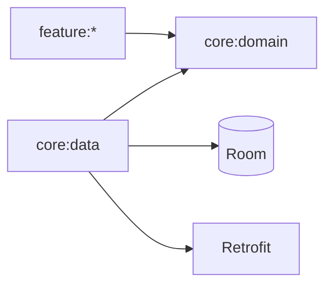

# Writing rules — reference

## 1. Diátaxis in one table

| Type | Reader's state | Serves | Form | Never |
|---|---|---|---|---|
| **Tutorial** | "Teach me, I'm new" | Learning | A guaranteed-to-succeed lesson, one path | Offer choices, explain theory, show edge cases |
| **How-to guide** | "I have a goal" | A task | Numbered steps, assumes competence | Teach basics, wander into background |
| **Reference** | "What are the facts?" | Information | Complete, structured, neutral | Instruct, persuade, hand-hold |
| **Explanation** | "Why is it like this?" | Understanding | Discussion, alternatives, history | Contain commands to follow |

The most common documentation failure is a page trying to be all four. Split it.

## 2. Sentence-level rules
- Active voice, present tense: "The build produces an AAB", not "An AAB will have been produced".
- Second person for instructions: "Run `./gradlew test`".
- One instruction per numbered step.
- Front-load the important word: "**To sign a release**, set these three variables" beats
  "There are three variables that need to be set in order to sign a release".
- Define an acronym once, on first use.
- Prefer a table to a paragraph whenever there are ≥ 3 parallel facts.
- Prefer a code block to a description of a code block.
- Banned words: simply, just, obviously, easily, clearly, trivial, straightforward, should work.
- Absolute paths and real names in examples; never `foo`, `bar`, `xyz`.

## 3. Code samples
- Every sample must run as-is against the documented version.
- Show the **command and the expected output**:
  ```bash
  ./gradlew testDebugUnitTest
  # BUILD SUCCESSFUL in 42s
  # 128 tests, 0 failures
  ```
- Keep samples minimal — remove everything not required to make the point.
- Show the wrong way too, but label it `❌` and always follow with the right way.
- Never abbreviate with `...` inside a snippet the reader is meant to copy.
- Include the imports when the type is ambiguous.
- Test samples in CI where feasible (extract and compile them).

## 4. API documentation (KDoc / Javadoc)

```kotlin
/**
 * Refreshes articles from the network and stores them locally.
 *
 * The local database remains the single source of truth: observers of
 * [observeArticles] are notified once the write completes.
 *
 * @param force when true, bypasses the 5-minute freshness window.
 * @return [Outcome.Success] when the refresh completed, or [Outcome.Failure]
 *   with [AppError.Offline] when there is no connectivity.
 * @throws CancellationException if the calling scope is cancelled.
 *
 * @sample com.company.app.samples.refreshArticlesSample
 */
suspend fun refresh(force: Boolean = false): Outcome<Unit>
```
Rules:
- Document **contract and behaviour**, not the implementation.
- Every public API: purpose, params, return, thrown types, thread-safety, nullability.
- Note whether the function is main-safe and which dispatcher it uses.
- Deprecations: `@Deprecated` with `ReplaceWith` and the removal version.
- Generate and publish (Dokka) as part of CI.

## 5. Code comments
Comment **why**, never **what**:
```kotlin
// ❌
i++ // increment i

// ✅
// The API returns page indices starting at 1; our paging library is 0-based.
val apiPage = page + 1

// ✅ non-obvious constraint
// Must stay under 5 s: the system kills the receiver after that.
```
Use `TODO(owner): reason + issue link` — a TODO without an owner is a lie.

## 6. Diagrams
Prefer Mermaid in Markdown (diffable, renders on GitHub, editable by the agent):

Rules: one idea per diagram; label every arrow; keep it under ~12 nodes; never ship a diagram
without a sentence saying what to notice in it.

## 7. Review checklist
- [ ] Correct Diátaxis type; no mixing.
- [ ] Reader and their goal are identifiable in the first two sentences.
- [ ] Prerequisites listed; commands verified on a clean environment.
- [ ] Expected output shown for each command.
- [ ] Failure modes and recovery documented.
- [ ] No banned words; reading level appropriate.
- [ ] Tables used for parallel facts; code blocks for code.
- [ ] Links resolve (run the link checker); no duplicate canonical facts.
- [ ] Version numbers come from one place.
- [ ] Screenshots are current, and no screenshots of text.
- [ ] Arabic/localised docs, if any, are in sync with the English source.

## 8. Automation
```yaml
# CI: docs quality
- name: Link check
  uses: lycheeverse/lychee-action@v2
  with: { args: --no-progress --exclude-mail './**/*.md' }

- name: Spell check
  uses: streetsidesoftware/cspell-action@v6

- name: Markdown lint
  run: npx markdownlint-cli2 "**/*.md" "#node_modules"

- name: Generate API docs
  run: ./gradlew dokkaHtmlMultiModule
```
Add a `cspell.json` project dictionary for domain terms so the checker is useful rather than noisy.

## 9. Keeping docs alive
- A PR that changes behaviour and touches no docs should be questioned in review.
- Add `docs/` paths to CODEOWNERS so the right people review them.
- Quarterly: run the quick start from scratch on a clean machine. If it fails, that is a P1 bug.
- Track "time to first successful build" for new contributors as the docs' KPI.
